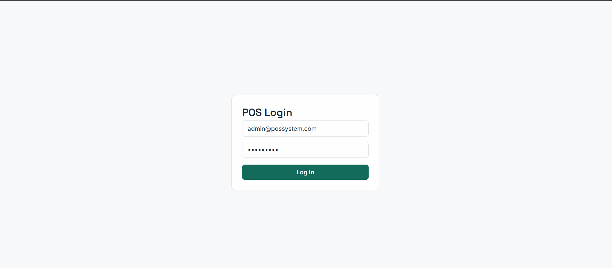

# POS System

A full-stack retail Point of Sale system built with **ASP.NET Core**, **React + Redux Toolkit**, and **SQL Server** — featuring role-based access control, real-time low-stock alerts via SignalR, and a Clean Architecture backend with test-driven business logic.

Built as a personal project to apply Clean Architecture principles and modern full-stack practices in a realistic, end-to-end system — not a tutorial clone.




## ✨ Features

- **JWT authentication** with role-based access control (Admin / Cashier)
- **Product & category catalog management** (Admin only)
- **Point-of-sale checkout flow** — cart, stock validation, order creation
- **Real-time low-stock alerts** pushed live via SignalR the moment a sale drops stock below reorder level
- **Admin dashboard** — today's sales, top products, recent orders, low-stock count
- **Search/filter** across the product catalog
- Fully containerized with **Docker Compose** — one command to run the whole stack


## 🏗️ Architecture

**Backend** follows Clean Architecture — dependencies point inward toward `Domain`, with `Application` defining interfaces that `Infrastructure` implements:
Domain → entities, repository interfaces (no dependencies)
Application → business logic, DTOs, service interfaces
Infrastructure → EF Core, repositories, JWT, SignalR (implements Application's interfaces)
Api → controllers, DI wiring


**Frontend** is a Redux Toolkit + React app, organized by feature (`features/auth`, `features/products`, `features/cart`, etc.), with a shared axios client that automatically attaches JWT tokens.

## 🧪 Testing

Core business logic is covered by unit tests using **xUnit + Moq** — not for coverage-percentage's sake, but targeted at the rules that actually matter:

- SKU uniqueness on product creation
- Stock validation on checkout (rejects overselling)
- Atomic checkout — a multi-item cart either fully succeeds or fails with zero side effects
- Category deletion blocked when products still reference it

```bash
dotnet test
```

## 🚀 Quick start (Docker)

Requires [Docker Desktop](https://www.docker.com/products/docker-desktop/).

```bash
git clone https://github.com/Hashir-Qadeer/pos-system.git
cd pos-system
docker compose up --build
```

Once running:
- **Frontend**: http://localhost:3000
- **API / Swagger**: http://localhost:8090/swagger

**Demo login (Admin):**

Email: admin@possystem.com
Password: Admin123!

The catalog seeds automatically on first run — 6 categories, ~24 products.

## ⚙️ Tech stack

| Layer | Technology |
|---|---|
| Backend | ASP.NET Core 8, EF Core, SQL Server |
| Auth | JWT Bearer tokens, BCrypt password hashing |
| Real-time | SignalR |
| Frontend | React 19, TypeScript, Redux Toolkit, React Router |
| Testing | xUnit, Moq |
| Infra | Docker, Docker Compose |

## 📌 Known trade-offs (deliberate, for a demo/learning project)

- JWT signing key and demo Admin credentials are placeholders — a real deployment would use environment secrets / a vault
- JWT stored in `localStorage` on the frontend rather than an httpOnly cookie, for simplicity
- Seed data and the bootstrap Admin account only run in the `Development` environment
- No first-run "setup wizard" — the seeded Admin account is the intended bootstrap path

## 🗺️ Possible next steps

- Order returns/refunds
- Customer loyalty points at checkout
- Discount codes
- CI pipeline (GitHub Actions) running tests on push

## 📄 License

MIT